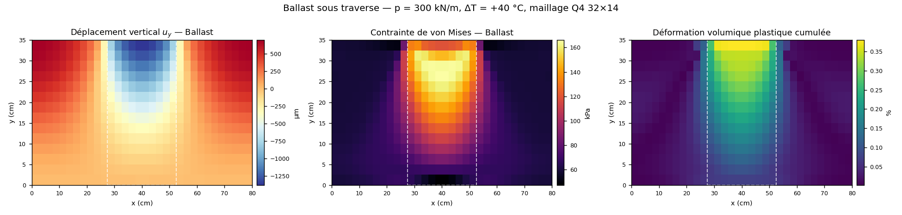
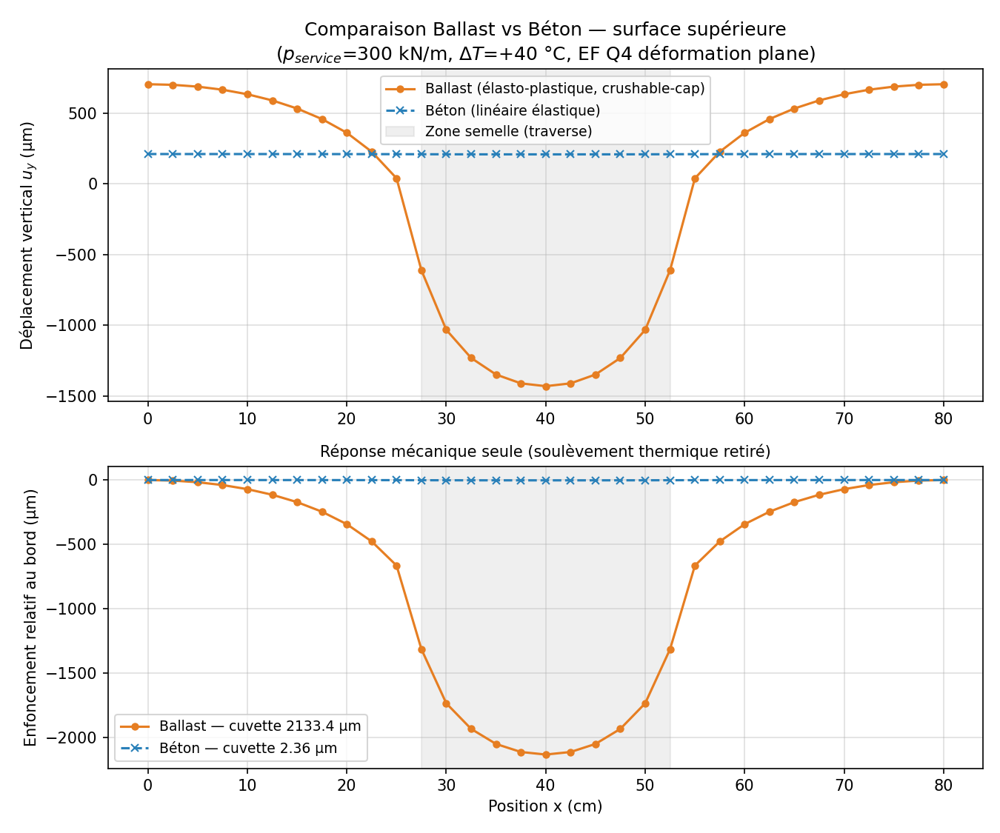

# thermal-fem-visualizer

[](https://github.com/kalmossa/thermal-fem-visualizer/actions/workflows/tests.yml)
[](https://www.python.org/)
[](LICENSE)

**Thermo-mechanical finite element simulation for railway track beds — in the browser.**

[](https://thermal-fem-visualizer.onrender.com)
<br><sub>Free hosting: the instance sleeps after 15 min of inactivity — first load can take ~30-60s to wake up.</sub>

A Python solver computes nodal displacements under combined mechanical and thermal
loading. A Flask REST API exposes it. A single-page HTML5 interface drives it live and
renders the mesh, the stress and plastic-state fields, the surface profiles and the run
history — in English or French, one click apart.

Move a slider and the solver runs. Under the hood it is a real finite element solve, not
an interpolation and not a lookup table.



---

## The question it answers

Lay a railway track and you must choose what carries it: ballast — loose crushed stone —
or a concrete slab. The two behave nothing alike under a passing train, and the choice
drives track geometry maintenance, service life and behaviour in heat and frost.

Answering that properly means a finite element calculation, which usually means a
heavyweight desktop package. This puts the same calculation behind a URL.

### Result

Under a 300 kN/m sleeper load and a +40 °C temperature rise:

| | Ballast | Concrete |
|---|---|---|
| Displacement at the edge | +703 µm (thermal uplift) | +210 µm |
| Displacement under the sleeper | **−1430 µm** | **+208 µm** |
| Mechanical bowl | **2133 µm** | **2.36 µm** |
| Peak plastic strain | 0.46 % | — stays elastic |

Concrete is 200 times stiffer: it sinks 2.4 µm and stays entirely lifted by thermal
expansion. Ballast sinks 2.1 mm, part of it irreversibly through grain compaction. The
bowl ratio is about 900 — the stiffness ratio of 200, amplified by the ballast's
plasticity.



> Measuring the **bowl** — settlement under the sleeper relative to the edge — rather
> than raw displacement is not a detail. Raw displacement is dominated by uniform thermal
> uplift, which depends mostly on the expansion coefficient and hides stiffness
> differences entirely.

---

## Features

**Simulation** — Q4 bilinear elements, 2×2 Gauss quadrature, plane strain, incremental
Newton-Raphson. Five mesh levels from 16×7 to 64×28. Displacement, von Mises stress and
cumulative plastic strain fields, on a locked colour scale so a heavier load visibly
reddens the picture.

**Material comparison** — eight track-bed materials, from fresh and consolidated ballast
to bituminous base, unbound sub-base, silty subgrade and steel. Ranked by bowl depth on a
log scale, because the spread covers three orders of magnitude.

**Layered profiles** — stack up to four layers, compare four stacks at once. This is
where it becomes a design aid: *what does 10 cm of bituminous base buy me over pure
ballast?* The answer is counter-intuitive and correct — thinning the ballast **reduces**
settlement, because ballast is the plastic link in the chain.

| Profile, 35 cm of bed | Bowl |
|---|---|
| Ballast only | 2133 µm |
| Ballast 25 cm + bituminous base 10 cm | 1737 µm |
| Ballast 16 cm + bituminous base 19 cm | **946 µm** |
| Ballast 25 cm + soft subgrade 10 cm | 2089 µm |

**Sleeper bending** — Euler-Bernoulli beam on a Winkler foundation, solved by finite
elements, with the Hetényi closed form as reference. Bending moment, ballast reaction and
characteristic length, all responding to sleeper stiffness, ballast modulus and fastening
stiffness.

**PCM thermal study** — five phase change materials, 180 simulations sorted along four
axes, 36 comparison charts, three reference cases.

**Standards catalogue** — searchable, filterable index of Belgian rail infrastructure
standards relevant to track bed design.

**In-app documentation** — method, constitutive laws, architecture, validation strategy
and model limits, readable from the interface in both languages.

---

## Quick start

```bash
py -m pip install -r requirements.txt
py app.py
```

Open **http://localhost:5000**.

Without a server, double-clicking `fem_visualizer.html` still works: the page falls back
to an embedded dataset and says so in plain words. A test forbids that dataset from
drifting away from the solver.

### Docker

```bash
docker build -t fem-visualizer .
docker run -p 8000:8000 -e FEM_ALLOWED_ORIGIN=https://example.org fem-visualizer
```

Gunicorn under an unprivileged user, healthcheck on `/api/health`. `render.yaml` and
`Procfile` cover Render and Heroku-compatible platforms.

---

## Architecture

Three layers, one job each, no overlap.

| Layer | File | Role |
|---|---|---|
| Frontend | `fem_visualizer.html` | Single HTML5 page — Canvas 2D, Chart.js, Fetch API, bilingual, no build step |
| REST API | `app.py` | Flask — parameter bounds, rate limiting, caching, security headers, logging |
| Solver | `fem_ballast_beton.py` | Mesh, constitutive laws, layers, Newton-Raphson, vectorised assembly |
| Materials | `materials.py` | Track-bed material library, bilingual labels |
| Sleeper | `track_beam.py` | Beam on elastic foundation (Winkler / Hetényi) |

No JavaScript framework, deliberately: the page must open by double-click on any machine,
with no install, no build and no `node_modules`. The only external dependency is Chart.js
from a CDN.

### API

| Method | Route | Role |
|---|---|---|
| `GET` | `/api/mesh` | mesh: nodes, connectivity, boundaries |
| `POST` | `/api/run-simulation` | run a computation, return results and fields |
| `GET` | `/api/results/<id>` · `.csv` | replay a run, export it |
| `GET` | `/api/history` | session run list |
| `GET` | `/api/materials` | material library, bilingual labels |
| `POST` | `/api/compare-materials` | overlay several materials |
| `POST` | `/api/profile` | compare layered profiles |
| `POST` | `/api/twin-rail` | sleeper bending under both rails |
| `GET` | `/api/health` | service status |

```bash
curl -X POST http://localhost:5000/api/profile \
  -H "Content-Type: application/json" \
  -d '{"profiles": [
        {"nom": "ballast only",  "layers": [{"id": "ballast", "epaisseur": 1}]},
        {"nom": "ballast + base","layers": [{"id": "ballast",      "epaisseur": 0.7},
                                            {"id": "grave_bitume", "epaisseur": 0.3}]}]}'
```

---

## Correctness

A finite element result that looks plausible is not the same as a correct one. This
solver is checked against things that can be known independently, and every fix below
carries a regression test.

### Solver

| Defect | Effect | Test |
|---|---|---|
| Thermal load sign inverted in the residual | heating made the surface **sink** | `test_signe_thermique` |
| (1+ν) factor missing from the plane strain reduction | thermal load 20 % too low | `test_dilatation_libre` |
| `U` overwritten each increment instead of accumulated | only `1/nsteps` of the load applied | `test_independance_au_nombre_d_increments` |
| Zero strain passed to the constitutive law | plasticity never driven by the load | idem |
| Cap centred on the tensile side | hardening *reduced* bearing capacity | `test_cap_se_consolide_en_compression` |
| σ_zz rebuilt from ν(σ_xx+σ_yy) after plastic return | 17 % drift between 4 and 24 increments | `test_independance_au_nombre_d_increments` |
| J₂ malformed, shear ignored | deviator wrong by √3 | `test_von_mises_cisaillement_pur` |
| **Load resultant depended on the mesh** | **80 % to 100 % of the prescribed load** | `test_resultante_de_charge` |
| Non-finite values serialised as `NaN` | HTTP 200 with a body no JSON parser accepts | `test_reponse_toujours_json_valide` |
| `dN/dx` missing the inverse Jacobian transpose | latent: wrong on any non-rectangular mesh | `test_patch_test` |

The load resultant is the one that most distorted conclusions. Selecting the nodes inside
the loaded strip and weighting them by the trapezoid rule applies
`p × (last node − first node)` — between 80 % and 100 % of the prescribed load depending
on mesh fineness. Every convergence study built on it was comparing runs under different
loads. Once fixed, plastic mesh convergence becomes monotone: 2066, 2121, 2133, 2143,
2143 µm from 16×7 to 64×28.

### Interface

| Defect | Correction |
|---|---|
| Progress bar simulated with `setTimeout`, no computation behind it | the frontend calls the solver and reports its real solve time |
| Overlay tab: "temperature", "flux", "energy" fabricated from sines of position | fields taken from the solver's Gauss points |
| Twin-rail tab: deflection approximated by Gaussian lobes with unjustified constants | Euler-Bernoulli beam on a Winkler foundation |
| Offline dataset presented as a live simulation | explicit banner, and a test forbids it from drifting |
| Colour scale normalised per run, so the picture never changed | scale locked to a reference range, with an auto toggle |

### Tests

```bash
py -m pytest -v
```

| Suite | Tests | Covers |
|---|---|---|
| `test_fem.py` | 28 | patch test, exact quadrature, analytical solutions, convergence |
| `test_api.py` | 60 | status codes, response shapes, bounds, caching, rate limiting, JSON validity |
| `test_track_beam.py` | 27 | beam on elastic foundation, convergence to Hetényi, equilibrium |
| `test_profil.py` | 21 | layered profiles, cyclic loading, hardening monotonicity |
| `test_artefacts.py` | 8 | embedded artefacts and translation dictionaries cannot drift |

**144 tests.** CI runs them on Python 3.11 to 3.13, then regenerates the figures, the
offline dataset and the exported CSV files and checks they have not drifted from what the
repository holds.

### Performance

Assembly is vectorised — precomputed strain-displacement matrices, one `einsum` for
element matrices, one sparse construction for the global one. Newton uses a consistent
tangent obtained by finite differences on the full return mapping.

| | Before | After |
|---|---|---|
| Full case, 32×14, 6 increments | ~4 s | **0.7 s** |
| Newton iterations per increment | ~134 | **8** |

---

## Hardening

The API is a public surface running an expensive computation on demand, and is treated as
one.

- Parameter bounds checked before the solver is reached; out-of-range input returns an
  explicit 400.
- Rate limit per client per minute — one request costs ~0.7 s of core time.
- Request bodies capped at 1 MB.
- Serialisation refuses non-finite values: a `NaN` in a 200 response is not valid JSON and
  breaks the client with an unreadable error.
- Divergence detected and reported as 422 with a message, never as garbage.
- Generic errors to the client, full trace to the log only.
- `X-Content-Type-Options`, `X-Frame-Options`, `Referrer-Policy`, `no-store` on API
  routes, HSTS when served over TLS.
- Werkzeug debugger disabled — it is an interactive shell.

---

## Layout

```
fem_ballast_beton.py        solver: mesh, constitutive laws, layers, Newton
materials.py                track-bed material library
track_beam.py               sleeper on elastic foundation
app.py                      Flask REST API
fem_visualizer.html         single-page bilingual interface
test_*.py                   five validation suites
tools/make_figures.py       regenerates the README figures
tools/make_offline_data.py  regenerates the page's offline dataset
tools/make_report.py        regenerates the technical report from live results
pcm-thermal/                180 PCM simulations, classifier, static page
docs/                       figures and technical report
```

`tools/make_report.py` deserves a note: the technical report in `docs/` is generated from
the solver, so every number in it is computed at build time. It cannot drift from the
code — which is exactly how the first version of this project ended up documenting
results that no longer matched what it computed.

### PCM classification

```bash
cd pcm-thermal
py organiser.py
```

Sorts the 180 `THERM_*.csv` files along four axes (material, thickness, convection,
initial condition), produces 36 charts and extracts three reference cases. Classification
uses hard links: the four trees do not duplicate 27 MB of byte-identical data.

---

## Known limits

- **No shear failure envelope.** The cap alone does not bound the elastic domain at low
  confinement, so full unloading falls outside the model — the solver refuses it rather
  than returning a number.
- **No cyclic degradation.** The model shows shakedown after the first cycle, whereas real
  track settles progressively under traffic. That is the industrial question, and it needs
  a different constitutive law.
- Cap parameters are orders of magnitude, not triaxial test results. Trends are usable;
  absolute values are not predictions.
- Small strains, static loading. No dynamics, no train speed, no loss of sleeper-ballast
  contact.
- Layer interfaces must fall on mesh lines; the solver refuses a layer too thin for the
  discretisation rather than approximating it.

---

MIT licensed. Built by [Elias Lallouet](https://github.com/kalmossa).
